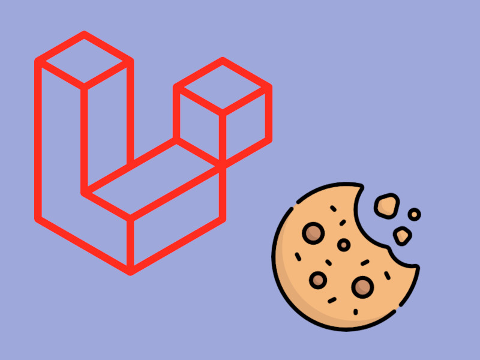
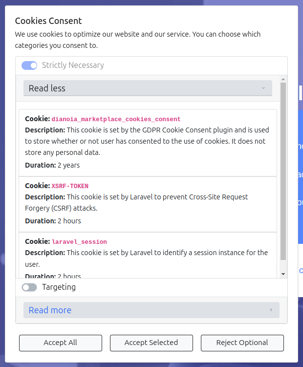
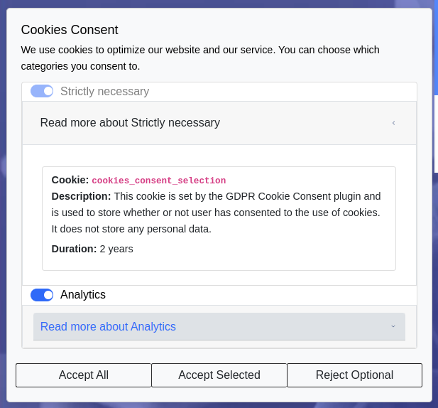

# Laravel Cookies Consent Plugin - Make your Laravel app compliant with the EU GDPR cookie law

<p align="center">

</p>


<hr>

[](https://packagist.org/packages/scify/laravel-cookies-consent)
[](https://github.com/scify/laravel-cookies-consent/actions?query=workflow%3Arun-tests+branch%3Amain)
[](https://github.com/scify/laravel-cookies-consent/actions?query=workflow%3A"Fix+PHP+code+style+issues"+branch%3Amain)
[](https://packagist.org/packages/scify/laravel-cookies-consent)
[](https://img.shields.io/github/issues/scify/laravel-cookies-consent)
[](https://img.shields.io/github/stars/scify/laravel-cookies-consent)
[](https://img.shields.io/github/forks/scify/laravel-cookies-consent)
[](https://github.com/dwyl/esta/issues)
[](https://opensource.org/licenses/Apache-2.0)
[](https://GitHub.com/Naereen/StrapDown.js/graphs/commit-activity)
[](https://GitHub.com/scify)
[](https://github.com/scify/laravel-cookies-consent/graphs/contributors)
[](https://github.com/scify/laravel-cookies-consent/pulls)
[](https://github.com/scify/laravel-cookies-consent/pulls?q=is%3Apr+is%3Aclosed)

## Upgrading from v2 to v3

As of **January 2025**, The v3 of the Laravel Cookies Consent plugin has been released! 🎉🥳😍

In order to upgrade from v2 to v3, please follow the instructions in the [CHANGELOG](CHANGELOG.md) file.

## Upgrading from v1 to v2

As of **October 2024**, The v2 of the Laravel Cookies Consent plugin has been released! 🎉🥳😍
In order to upgrade from v1 to v2, please follow the instructions in the [How To Upgrade to v2](how-to-upgrade-to-v2.md)
file.

## About the plugin

According to the [GDPR law](https://gdpr-info.eu/), every platform is required to allow the users to decide which cookie
categories they will allow,
and, if a cookie category is not allowed, the application should not use the functionality tied to that cookie.

This plugin provides a simple cookie consent window through which the user can specify the cookies they would like to
allow.

After the user submission, the page reloads and the relevant cookies are set on the browser, and can then be used in the
front-end.

# Screenshots





## Features

- Customizable cookie categories
- A new configuration file format. Now you can declare the cookies each cookie category uses in a
  more structured way.
- A new, clean, and intuitive UI for the cookies consent modal.
- An option to present the cookies consent dialog in a separate page instead of a modal.
- A stick cookies button that allows users to change their cookies preferences at any time. This button is optional and
  it's existence can be tweaked in the configuration file.
- A separate page for the cookies preferences, where users can read more about each cookie category and change their
  preferences.

## Installation

You can install the package via composer:

```bash
composer require scify/laravel-cookies-consent
```

**Make sure to manually publish** the styles file, by running:

```bash
php artisan vendor:publish \
--provider="SciFY\LaravelCookiesConsent\LaravelCookiesConsentServiceProvider" \
--tag="cookies-consent-assets"
```

**Notice:** if a new version of the plugin has been released and you want to update the styles file, please make sure to
use `--force` option, to overwrite the files.

By doing so, the assets files will be copied to `public/vendor/cookies_consent`.

**IMPORTANT:**

You can then either decide to include the `public/vendor/cookies_consent/*` files to git (especially if you
want
to edit it first), or add it to `.gitignore`, and make sure to also run this command on the staging/production server.

Next, you need to publish the config file:

```bash
php artisan vendor:publish \
--provider="SciFY\LaravelCookiesConsent\LaravelCookiesConsentServiceProvider" \
--tag="cookies-consent-config"
```

The configuration file will be published to `config/cookies_consent.php`.

### Explanation of the configuration file

In the config file, you can change the cookie categories of your application, set the required and pre-selected
categories, as well as add new categories.

This is the contents of the published config file:

```bash
return [
    /**
     * This prefix will be applied when setting and getting all cookies.
     * If not set, the cookies will not be prefixed.
     * If set, a good strategy is to also add a trailing underscore "_", that will be added between the field value, and each cookie.
     * For example, if `cookie_prefix` is set to `my_app_`, then the targeting cookie will have a value of `my_app_cookies_consent_targeting`.
     * When using this plugin for multiple apps, it is a good strategy to set a prefix that is relevant to the app
     * (for example "my_app_", in order for the cookies not to be mingled when running locally.
     */
    'cookie_prefix' => '',
    'display_floating_button' => true, // Set to false to display the footer link instead
    'use_separate_page' => false, // Set to true to use a separate page for cookies explanation
    /*
    |--------------------------------------------------------------------------
    | Editor
    |--------------------------------------------------------------------------
    |
    | Choose your preferred cookies to be shown. You can add more cookies as desired.
    | If, for example you add another cookie with the name "marketing", then you should also
    | publish the translation files and add a "cookie_marketing" key in the translation file,
    | since the plugin will try to display the cookie name by this convention.
    |
    | Built-in: "strictly_necessary"
    |
    */
    'cookies' => [
        'strictly_necessary' => [
            [
                'name' => 'cookieConsent',
                'description' => 'This cookie is set by the GDPR Cookie Consent plugin and is used to store whether or not user has consented to the use of cookies. It does not store any personal data.',
                'duration' => '2 years',
                'policy_external_link' => null,
            ],
            [
                'name' => 'XSRF-TOKEN',
                'description' => 'This cookie is set by Laravel to prevent Cross-Site Request Forgery (CSRF) attacks.',
                'duration' => '2 hours',
                'policy_external_link' => null,
            ],
            [
                'name' => 'laravel_session',
                'description' => 'This cookie is set by Laravel to identify a session instance for the user.',
                'duration' => '2 hours',
                'policy_external_link' => null,
            ],
        ],
    ],
    'enabled' => [
        'strictly_necessary',
    ],
    'required' => ['strictly_necessary'],
    /*
     * Set the cookie duration in days.  Default is 365 days.
     */
    'cookie_lifetime' => 365,
];
```

The `cookie_prefix` is optional and, if set, will be applied to every cookie.

If set, a good strategy is to also add a trailing underscore "_", that will be added between the field value, and each
cookie.

For example, if `cookie_prefix` is set to `my_app_`, then the targeting cookie will have a value
of `my_app_cookies_consent_targeting`.

The `display_floating_button` field is optional and, if set to `true`, will display a floating button on the bottom
right corner of the page.
If set to `false`, then you will need to add a relevant link in your footer, in order to show the cookies preferences
page:

```html
<a href="javascript:void(0);" onclick="toggleCookieBanner()">Cookies Preferences</a>
```

The `use_separate_page` field is optional and, if set to `true`, will display the cookies preferences in a separate
page.

You can add as many cookie categories as you like, simply by adding values to the `cookies` array.

If you want to remove a cookie category, simply remove it from the array.

You can use the `enabled` array to set the cookie categories that will be pre-selected,
and the `required` array to set the cookies that the user won't be able to deselect.

If you want to change how long the cookies will be stored, edit the `cookie_lifetime` variable.

## Usage

When the plugin is installed, a `laravel-cookies-consent`
custom [Laravel View Component](https://laravel.com/docs/9.x/blade#components) is automatically registered.

This will render the following cookies consent that, will look very much like this one.


You can then use this component in order to display the cookies consent window, wherever you'd like.

Typically, a good strategy is to put the component just before the closing `<body>` tag:

```bash
<body>
    ...
    ...
    ...
    <x-laravel-cookies-consent></x-laravel-cookies-consent>
</body>
```

After that, you can use the `$_COOKIE` global object, in order to check for the appropriate cookie.

Now you can use this object in your Blade files like this:

```bash
$_COOKIE[config('cookies_consent.cookie_prefix') . {{ COOKIE_NAME }}]
```

For example, An application that wants to load the Google Analytics script only if the user has given their consent to
the `targeting` cookie category,
might do the following:

```php
<!-- Check the 'targeting' cookie: -->
@if(isset($_COOKIE[config('cookies_consent.cookie_prefix') . 'cookies_consent']))
    @php
        $cookiesConsent = json_decode($_COOKIE[config('cookies_consent.cookie_prefix') . 'cookies_consent'], true);
    @endphp
    @if(isset($cookiesConsent['targeting']) && $cookiesConsent['targeting'] && config('app.google_analytics_id'))
        <!-- Google Analytics -->
        <script defer async>
            (function (i, s, o, g, r, a, m) {
                i['GoogleAnalyticsObject'] = r;
                i[r] = i[r] || function () {
                    (i[r].q = i[r].q || []).push(arguments)
                }, i[r].l = 1 * new Date();
                a = s.createElement(o),
                    m = s.getElementsByTagName(o)[0];
                a.async = 1;
                a.src = g;
                m.parentNode.insertBefore(a, m)
            })(window, document, 'script', 'https://www.google-analytics.com/analytics.js', 'ga');

            window.ga('create', '{{ config('app.google_analytics_id') }}', 'auto');
            window.ga('set', 'anonymizeIp', true);
            window.ga('send', 'pageview');
        </script>
    @endif
@endif
```

In this example, we checked whether
the `$_COOKIE[config('cookies_consent.cookie_prefix') . 'cookies_consent_targeting']` key exists or not.

## Customization

### Customizing the component texts

If you want to modify the texts shown in the cookies dialog, you can publish the language resource files with this
command:

```bash
php artisan vendor:publish \
--provider="SciFY\LaravelCookiesConsent\LaravelCookiesConsentServiceProvider" \
--tag="cookies-consent-translations"
```

This will publish this file to `resources/lang/vendor/cookies_consent/{{lang}}/messages.php`.

The plugin comes with 6 built-in languages. You can change the translations for a given language, or add additional
languages yourself.

### Customizing the "Read more" link

In the cookies dialog, there is also an optional "Read more" link. This link is specified in the language translation
files, since it is common to have a different link for each language.

Example (file `lang/vendor/cookies_consent/en/messages.php`):

```php
return [
    ...
    'read_more_link' => '',
    ...
];
```

If the link is left empty (default state), it won't be shown.

### Customizing the component contents

If you need full control over the contents of the cookies dialog, you can publish the views of the package:

```bash
php artisan vendor:publish \
--provider="SciFY\LaravelCookiesConsent\LaravelCookiesConsentServiceProvider" \
--tag="cookies-consent-components"
```

This will copy the `resources/views/components/laravel-cookies-consent` view file over
to `resources/views/components/vendor/cookies_consent` directory.

## Development

In order to locally run the package, you should use a local Laravel application, in which you are going to install it.

Make sure that the `composer.json` file of the Laravel app has the following entry:

```text

"require": {
    "scify/laravel-cookies-consent": "@dev",
}
...
...
"repositories": [
        {
            "type": "path",
            "url": "../path/to/laravel-cookies-consent/",
            "options": {
                "symlink": true
            }
        }
    ],
"minimum-stability": "dev",
```

This will tell composer that the code for the package is of the `"@dev"` version and that it exists in the specified
path.

Then run:

```bash
composer update scify/laravel-cookies-consent --prefer-source
```

To fetch the local package.

## Testing

This project uses [Pest](https://pestphp.com/) for testing. To execute the test suite, run:

```bash
composer test
```

## FAQ

**Question:** Is this plugin free to use?

**Answer:** Yes. This plugin is totally free and developed as
an [Open-Source project](https://github.com/scify/laravel-cookies-consent).

---

**Question:** How long do the cookies last?

**Answer:** The duration is set in days, in `config/cookies_consent.php` file. In order to publish this file, run

```bash
php artisan vendor:publish \
--provider="SciFY\LaravelCookiesConsent\LaravelCookiesConsentServiceProvider" \
--tag="cookies-consent-config"
```

The configuration file will be published to `config/cookies_consent.php`.

Then, edit the `cookie_lifetime` field (in days).

---

**Question:** Will the cookie consent window show every time?

**Answer:** No. As soon as the user clicks one of the "Accept all", "Accept selection", or "Decline all", the selection
will be stored in another cookie, and the window won't pop up again, until this cookie expires, or is deleted.

---

**Question:** In which languages is the plugin available?

**Answer:** The plugin has 6 built-in languages: English, Greek, Spanish, German, Italian, and Swedish. If you would
like to add a language, publish the translations by running:

```bash
php artisan vendor:publish \
--provider="SciFY\LaravelCookiesConsent\LaravelCookiesConsentServiceProvider" \
--tag="cookies-consent-translations"
```

And add/change your own translations. If you add a new language, consider also opening
a [pull request](https://github.com/scify/laravel-cookies-consent/pulls), in order for this language to be included in
the plugin.

---

**Question:** Does this plugin work with all Laravel versions?

**Answer:** We have tested the plugin with Laravel 7, 8, and 9. The plugin's simplicity allows it to work with any
Laravel version, but if you try it with a version other that the tested ones and it does not work, please open an issue
on [GitHub](https://github.com/scify/laravel-cookies-consent/issues).

---

**Question:** If I install later a new cookie category, how can I force the plugin to "reset" and show again?

**Answer:** The easiest way is to publish the configuration file, and change the `cookie_prefix` field. This will force
the plugin to show again.

## Changelog

Please see [CHANGELOG](CHANGELOG.md) for more information on what has changed recently.

## Contributing

Please see [CONTRIBUTING](CONTRIBUTING.md) for general details.

### PHP code style - Laravel Pint

This application uses [Laravel Pint](https://laravel.com/docs/9.x/pint) in order to perform code-style.

In order to run the styler, run :

```bash
./vendor/bin/pint --test -v # the --test will not do any changes, it will just output the changes needed

./vendor/bin/pint -v # this command will actually perform the code style changes 
```

### Releasing a new version

After you have committed your changes, create a new git tag:

```bash
git tag -a vx.y.z -m "This is a nice tag name"
```

(for the `x.y.z` version number, follow the [Semantic Versioning](https://semver.org/) guidelines).

Then, push the tag:

```bash
git push origin vx.y.z
```

Then, in the [GitHub Releases page](https://github.com/scify/laravel-cookies-consent/releases), create a new Release *
*and correlate it with the tag that you just created.**

That's it! Packagist will be updated automatically.

Also, don't forget to update the `CHANGELOG.md` file with the new version name, release date, and release notes.

## Credits

- [SciFY Dev Team](https://github.com/scify)

## License

The Apache Licence. Please see the [Licence File](LICENCE.md) for more information.
